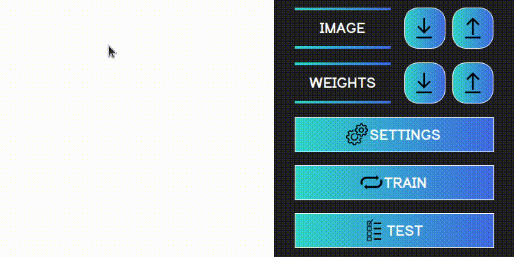
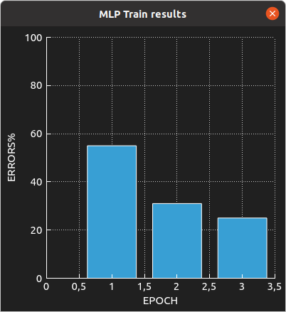
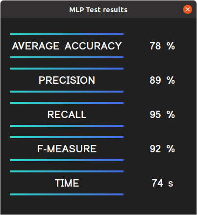
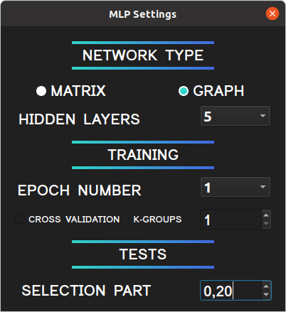

# Multilayer Perceptron: letters recognition

## Содержание

Данный проект - это нейросеть с несколькими реализациями, которая распознает буквы латинского алфавита.
У нейросети есть два варианта исполнения. Интерфейс интуитивно понятен и не нуждается в особом рассмотрении.
1. Матричная нейросеть - все слои представлены в виде матрицы весов.
2. Графовая - каждый нейрон представлен отдельным объектом который связан с остальными.

Для сборки нужны:
1. `CMAKE 3.5` и выше
2. `QT 5.15.2` и выше

Все данные необходимые для обучения и тестов нейросети находятся в архиве `emnist/emnist-data.tar.gz`

## Пример работы

    
## Входные данные

Для того чтобы нейросеть могла определить буквы на нарисованном или загруженном изображении, необходимо либо обучить
нейросеть, либо загрузить уже готовые веса.
1. Изображение рисуется  в левой части экрана на белом холсте с помощью ЛКМ, для того что бы стереть
 нарисованное изображение - нажмите ПКМ. По мере отрисовки нейросеть будет предсказывать нарисованную вами букву.
 Далее это нарисованное изображение можно сохранить с помощью кнопки `↓` в выбранную вами директорию.
2. Можно загрузить изображение с помощью кнопки `↑`, после этого оно появится на холсте в левой части,
  где его можно отредактировать.

## Обучение

Для того чтобы нейросеть могла определить букву, необходимо обучить её, либо же загрузить уже готовые веса.

1. Обучение запускается на кнопку `TRAIN` в отдельном потоке, с параметрами из настроек (по умолчанию это классическое 
обучение матричной нейросети с двумя скрытыми слоями и одной эпохой обучения), настройки можно задавать самому,
об этом далее. После обучения будет открыт график отражающий процент ошибки нейросети на каждой из эпох обучения.
При желании можно сохранить полученные веса на кнопку  `↓` в выбранную вами директорию.
2. Также можно загрузить уже готовые веса c помощью кнопки `↑`. Пользователь сам должен подобрать корректные веса
для того или иного типа сети.

## Тесты

После того как нейросеть обучилась или веса были загружены, можно провести тесты по указанной выборке
(от 0 до 1, в случае 0 - тестовой выборки нет, тесты не запускаются, в случае 1 - тестовая выборка 100%)
над данной нейросетью.
По нажатию на кнопку `TEST` запустится тестовый модуль в отдельном потоке, и откроется окно со всеми основными 
метриками. А именно:
1. Average accuracy (%)
2. Precision (%)
3. Recall (%)
4. F-measure (%)
5. Time (sec)

Входные тестовые данные также должны подбираться корректно самим пользователем.

## Настройки 

Настройки открываются на кнопку `SETTINGS`, в них можно настраивать:
1. Тип нейросети, графовая или матричная. `MATRIX` или `GRAPH`.
2. Количество скрытых слоев. `2-5`.
3. Количество эпох для обучения (если отключена кросс-валидация). `1-5`.
4. Наличие кросс-валидации. `TRUE`или `FALSE`
5. Количество к-групп (если включена кросс-валидация). `1-10`.
6. Тестовую выборку. `0-1`.

Работу выполнили: Савин Антон (telvina), Андрей Дегтярев (sreanna).
